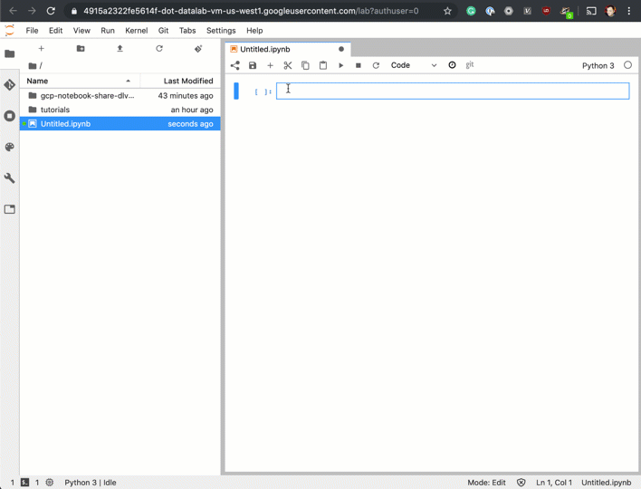

# JupyterLab Extension For Sharing Notebooks for GCP AI Platform



## Prerequisites

* Cloud AI Deep Learning VM (M33+)
* AI Platform Notebook Instance (M33+)
* AI Platform Deep Learning Containers (M32+)

## Installation Remote

This extension includes both a notebook server extension and a lab extension. In order to use it, you must enable both of them.

To install the server extension, run the following in your terminal:

```bash
sudo pip3 install share_nb
```

To install the lab extension, run:

```bash
sudo jupyter labextension install share_nb
```

Don't forget to restart jupyter:

```bash
sudo service jupyter restart
```

and refresh the browser tab.

## Installation From AI Platform Notebooks

* Open AI Platform Notebook
* Open Terminal
* Run the following commands for cloning:
   *  latest stable: ```git clone https://github.com/gclouduniverse/gcp-notebook-share-dlvm-extension.git --branch v0.1.1```
   * latest unstable: ```git clone https://github.com/gclouduniverse/gcp-notebook-share-dlvm-extension.git```
* Run the following commands for installing:
   * ```cd gcp-notebook-share-dlvm-extension```
   * ```./install.sh```
* Refresh browser tab
